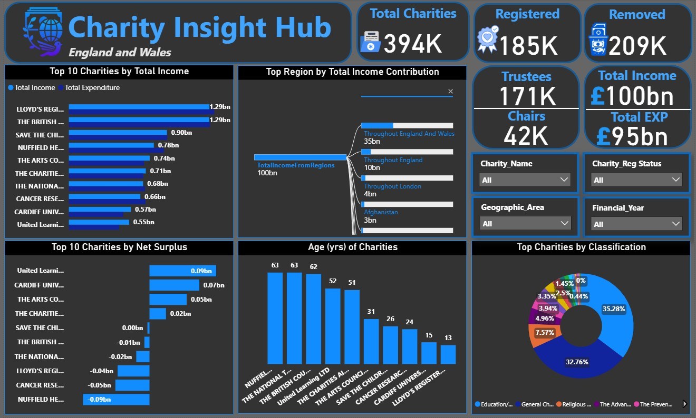
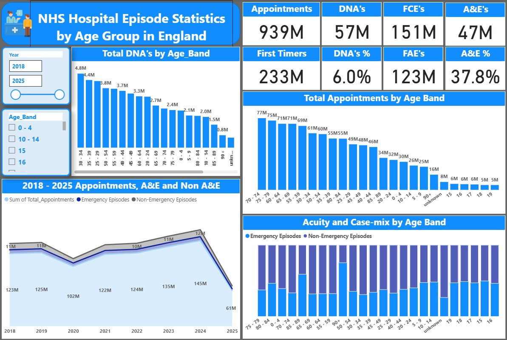

# Project 1

**Title**: Charity Insight Hub

**Tools Used**: Power BI Desktop, DAX, Power Query, Data Modeling, Text File/Data Cleaning & Transformation

**Project Description**: 
The Charity Insight Hub is an interactive Power BI dashboard designed to analyze charity performance data across England and Wales. It integrates multiple datasets, including charity registrations, financial statements, classifications, trustees, and geographic data, to deliver a single source of truth for monitoring financial health, governance, and sector trends. The project demonstrates advanced Power BI capabilities such as data modeling between seven relational tables, DAX calculations for KPIs, custom visuals for income/expenditure analysis, and decomposition trees for root-cause exploration. It also simulates real-world reporting tasks aligned with a Data Analyst role within an NGO (charity organisation), focusing on income insights, donor segmentation, and transparency in operations.

**Key findings**: 

Over 394K charities were analyzed, with 185K currently registered and 209K removed.

Total reported charity income exceeded £100 billion, with £95 billion in expenditure.

The “Throughout England and Wales” region contributed the largest share of total income (~35%) predominantly from charities with wider geographic scope, larger budgets, national programmes and therefore higher income.

Top-performing charities such as Lloyd’s Register Foundation and The British Council generated incomes exceeding £1 billion each.

Several charities reported consistent net surpluses, indicating strong financial management and operational sustainability.

The most common charity purposes were Education/Training (35%) and General Charitable Purposes (33%), showing strong emphasis on learning and welfare programs.

**Dashboard Overview**: 

Top 10 Charities by Income & Expenditure: Highlights key financial performers and spending balance.

Top Region by Income Contribution: Uses a Decomposition Tree to trace where the majority of funds originate.

Top 10 Charities by Net Surplus: Shows which organizations generate the largest financial surpluses.

Age of Charities: Provides insight into organizational maturity and longevity.

Classification Analysis (Donut Chart): Displays proportional distribution of charities by classification.

KPI Cards: Track total registered vs. removed charities, trustees, and overall income/expenditure to monitor sector scale and change over time.

Interactive Filters: Enable users to explore charities by name, registration status, geographic area, and financial year.

  
# Project 2

**Title**: 2018 - 2025 NHS Hospital Episode Statistics in England

**Tools Used**: Power BI Desktop, DAX, Power Query, Data Modeling, Excel/CSV Data Cleaning & Transformation

**Project Description**:
The NHS Hospital Episode Statistics (HES) is an interactive Power BI report built to analyze hospital activity across 2018–2025. It combines multiple HES tables (age groups, treatment specialty, provider and region). The first dashboard page focuses on age-based insights for episodes, appointments and non-attendance.

In Power Query, extensive cleaning was performed, including:

Splitting and cleaning the Age_Band field (e.g. 01. 0 - 4 → code 1, label 0 - 4) and creating a numeric AgeBand_Code used to sort age bands correctly.

Converting Date to a true date datatype and deriving a Year column (while deliberately not using a separate Date dimension).

Removing redundant columns, non zero characters, and duplicate records where Age_Band/Date combinations were repeated for the same record.

Ensuring all activity fields (FCE, FAE, appointments, DNA, emergency, etc.) were typed as whole numbers for accurate aggregation.

DAX was then used to build core KPIs and analytical measures, including Total FCE, Total Appointments, Emergency Episodes, Non-Emergency Episodes, DNA Rate % and others. The model demonstrates best practice in star-schema thinking on a single fact table, with measures driving all visuals and slicers (Year and Age_Band) enabling self-service exploration.

**Key findings**:

Across 2018–2025 there are roughly 939M total appointments, 151M FCEs and 123M FAEs, illustrating the scale of NHS hospital activity.

Around 57M appointments were DNAs, giving an overall DNA rate of ~6%.

Emergency episodes account for ~38% of all FAEs, highlighting the significant burden of unplanned care.

Demand by age is heavily skewed towards older working-age and early older-age groups (especially 60–64, 65–69, 70–74 and 75–79), which generate the highest appointment volumes.

DNA volumes peak in younger adults (roughly 25–44), then decline in older ages despite high attendance volumes, suggesting younger working-age adults are the highest risk for non-attendance and may require increased reminders via tex, email and auto generated phone calls.

The 2018–2025 trend shows a clear dip in 2020 associated with COVID-19, followed by recovery and activity exceeding pre-pandemic levels by 2023–2024; emergency care proves more resilient than elective activity.

The emergency share of episodes rises with age, particularly from 70+ upwards, indicating that older people drive a disproportionate share of urgent and emergency workload.

A small but visible “Unknown” age band remains, flagged as a data-quality issue that analysts and data owners may wish to address.

**Dashboard Overview**:

KPI Cards: Show high-level metrics such as total appointments, DNAs, FCEs, FAEs, DNA %, and A&E % to give an instant snapshot of demand and performance.

Total DNA’s by Age_Band (Column Chart): Ranks age bands by DNA volume, highlighting younger adult groups as the main contributors to missed appointments.

Total Appointments by Age Band (Column Chart): Displays the life-course profile of demand, with peaks in older working-age and early older-age groups and smaller volumes at the youngest and oldest ages.

2018–2025 Appointments, A&E and Non-A&E (Stacked Area Chart): Tracks overall appointments alongside emergency and non-emergency episodes over time, revealing the COVID-19 dip and post-pandemic recovery.

Acuity and Case-Mix by Age Band (100% Stacked Columns): Compares emergency vs non-emergency episodes across age bands to show how acuity increases with age, especially with senior citizens aged 90+.

Interactive Slicers (Year & Age_Band): Allow users to focus on specific years or age bands, dynamically updating all visuals and KPIs to support scenario-based analysis (e.g. “How did DNAs look for 20–24 year-olds in 2024?”).

