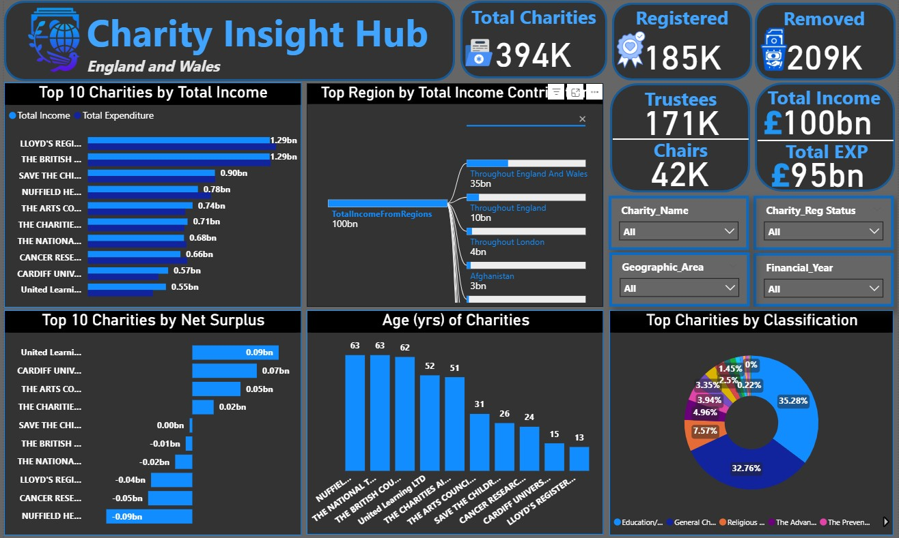

# Project 1

**Title**: Charity Insight Hub

**Tools Used**: Power BI Desktop, DAX, Power Query, Data Modeling, Data Cleaning & Transformation

**Project Description**: 
The Charity Insight Hub is an interactive Power BI dashboard designed to analyze charity performance data across England and Wales. It integrates multiple datasets, including charity registrations, financial statements, classifications, trustees, and geographic data, to deliver a single source of truth for monitoring financial health, governance, and sector trends. The project demonstrates advanced Power BI capabilities such as data modeling between seven relational tables, DAX calculations for KPIs, custom visuals for income/expenditure analysis, and decomposition trees for root-cause exploration. It also simulates real-world reporting tasks aligned with a Data Analyst role within an NGO (charity organisation), focusing on income insights, donor segmentation, and transparency in operations.

**Key findings**: 
Over 394K charities were analyzed, with 185K currently registered and 209K removed.

Total reported charity income exceeded £100 billion, with £95 billion in expenditure as at 2025.

The “Throughout England and Wales” region contributed the largest share of total income (~35%).

Top-performing charities such as Lloyd’s Register Foundation and The British Council generated incomes exceeding £1 billion each.

Several charities reported consistent net surpluses, indicating strong financial management and operational sustainability.

The most common charity purposes were Education/Training (35%) and General Charitable Purposes (33%), showing strong emphasis on learning and welfare programs.

**Dashboard Overview**: 
Top 10 Charities by Income & Expenditure: Highlights key financial performers and spending balance.

Top Region by Income Contribution: Uses a Decomposition Tree to trace where the majority of funds originate.

Top 10 Charities by Net Surplus: Shows which organizations generate the largest financial surpluses.

Age of Charities: Provides insight into organizational maturity and longevity.

Classification Analysis (Donut Chart): Displays proportional distribution of charities by classification.

KPI Cards: Track total registered vs. removed charities, trustees, and overall income/expenditure to monitor sector scale and change over time.

Interactive Filters: Enable users to explore charities by name, registration status, geographic area, and financial year.

